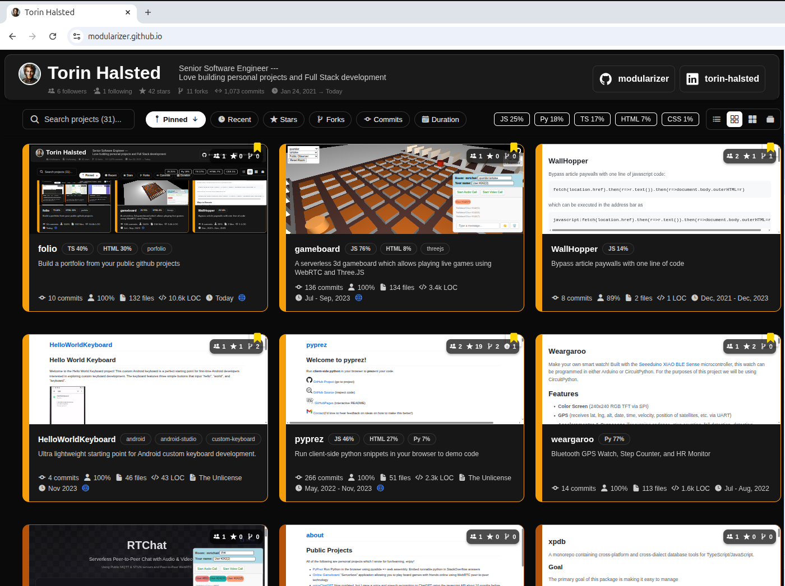

# Folio

Build a configurable portfolio from your public github projects.


### Sample

see https://github.com/modularizer/modularizer.github.io which was used to build https://modularizer.github.io/

### Try it live!

## Quickstart (if you don't want to do much customization)
### Basic 
1. Make a github repo to host a free GitHubPages Site
    - name the repo `yourusername.github.io` (using your actual name) if you want to create a site at your pages root https://youusername.github.io
    - if you name the repo anything else, e.g. `folio`, your site will be at https://youusername.github.io/folio
2. Add an `index.html` folder in the project root which imports our bundle
    ```html
    <!DOCTYPE html>
    <html lang="en">
    <script src="https://modularizer.github.io/folio/dist/folio.bundle.js?username=subdomain&init=true"></script>
    </html>
    ```
**NOTE:** 
- if you are deploying on a github.io subdomain using GitHub Pages it will auto-detect your username if you use `username=subdomain` in the script src url
- if you are using a custom domain, set`username=yourusername` e.g. `src="https://modularizer.github.io/folio/dist/folio.bundle.js?init=true&username=yourusername"`

### Add GitHub Token (Optional but highly recommended, adds features)
1. Create one at `https://github.com/settings/tokens/new?scopes=public_repo&description=Portfolio%20App`
2. Either...
   a. Hardcode it in your `index.html` using `&token=ghp_...` OR
   b. Insert it into the built site using a github workflow (it will **still be publicly accessible**, but given the limited scope that is okay, and this way it will not be committed to your github repo)
      1. under your project's Settings > Secrets and variables > Actions > Repository secrets > + New repository secret > PORTFOLIO_GITHUB_TOKEN
      2. copy [.github/workflows/deploy.yml.example](.github/workflows/deploy.yml.example) into your repo as `.github/workflows/deploy.yml`


## Setup (if you plan to customize)
1. Clone this repo
2. `npm install`
3. Create a token to use in the github api at `https://github.com/settings/tokens/new?scopes=public_repo&description=Portfolio%20App`
4. Copy [`.env.example`](.env.example) to `.env`
5. `npm run start` to start serving locally
6. modify users/ folder to configure

## Features

- 🎨 **Parameterized Theme System** - Dark mode with support for additional themes
- 📱 **Responsive Design** - Works beautifully on desktop, tablet, and mobile
- 🖼️ **Background Image Support** - Customizable dark background images
- 🎯 **TypeScript** - Strong typing throughout the codebase
- 🚀 **Expo Router** - File-based routing for easy navigation
- 💻 **React Native Web** - Write once, run on web and mobile
- 🔧 **Customizable Builders** - Each project can have its own custom rendering logic
- 👤 **User Data Separation** - Personal info and projects are separated from generic code
